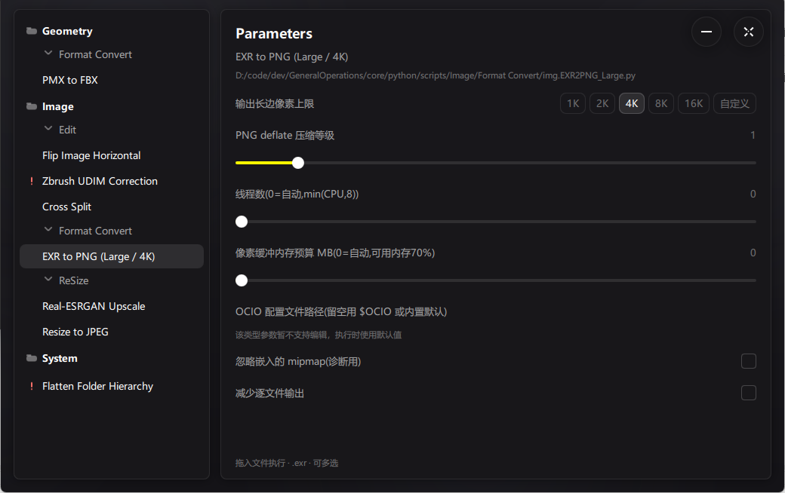

# GeneralOperations —— 脚本启动器 monorepo

把多个文件/文件夹拖进去做便捷处理的多功能启动器，主打 **geo**（几何模型）与
**img**（图像）两类处理。左侧选脚本、右侧调参数、拖文件进去执行；脚本用
Python，启动器优先复用目标机已兼容的系统 Python，必要时准备独立环境。

[](https://ghfind.com/u/sintaka?ref=badge)

[](https://ghfind.com/u/sintaka)



## 血统

三代仓库，一条主线：把散装脚本收口成一个启动器（完整决策与脚本映射见
`docs/ARCHITECTURE.md`「血统」）：

```
D:\code\dev\python\GeneralOperations      第一代：拖拽脚本集（13 个文件，每个脚本各配 .bat 做拖拽适配）
        │  脚本适配成 docstring 契约头；收口统一入口 + Python 环境托管
        ▼
D:\code\dev\qt\GeneralOperations-Qt5      第二代：Qt5 QML 启动器单仓（版本止于 0.1.00x）
        │  monorepo 化：多前端（ui/）× 多后端（core/）
        ▼
本仓库（D:\code\dev\GeneralOperations）   第三代：版本自 0.2.000 起算
```

## 仓库结构

```
GeneralOperations/
├── CMakeLists.txt        # 超级构建根：前端选择、GO_* 契约、输出与 zip 命名；全仓库唯一 project()
├── CMakePresets.json     # 全部 preset 收敛在此（qt5-mingw-debug 为默认）
├── AGENTS.md             # AI 协作约定：收尾流程、版本 bump、提交规范
├── .vscode/tasks.json    # VS Code 任务：配置 / 生成 / 运行 / 发行 zip / 单测 / 检查
├── .gitignore
├── ui/                   # 前端层（可替换的壳；一次只构建一个）
│   ├── qt5/              #   Qt 5.15 QML 启动器
│   ├── qt6.8lts/         #   Qt 6.8 LTS QML —— 占位（README + FATAL_ERROR 的 CMakeLists）
│   └── tauri2/           #   Tauri 2 + WebView2 前端（npm + Cargo）
├── core/                 # 内核层（后端；禁止依赖任何 ui 与 Qt）
│   ├── python/           #   Python 脚本内核：scripts/ 9 个契约卡/脚本 + 导出 GO_PYTHON_SCRIPTS_DIR
│   └── cpp/              #   C++ 纯函数内核 + PMX→GLB 独立后端及测试
├── docs/                 # 文档（索引见下）
│   ├── ARCHITECTURE.md   #   分层总览、关键契约、新增前端/后端、血统
│   ├── DEVELOPMENT.md    #   开发指南
│   ├── RELEASE.md        #   打包与发行
│   ├── SCRIPT_SPEC.md    #   脚本 docstring 契约
│   └── pitfalls/         #   踩坑记录（现象 / 根因 / 解决 / 验证）
├── tools/               # 共用发行装配、Tauri 发行入口及仓库静默检查
├── build/                # 构建目录：build/<preset>（构建期生成，已 gitignore）
└── output/               # 发行装配与 zip（构建期生成，已 gitignore）
```

## 快速开始

前置：`D:\Lib\Qt\5.15.2\mingw81_64`（编译器与 ninja 用 Qt 自带，preset 写的是
绝对路径，VSCode 不需要选 kit、不依赖 PATH；工具链说明见 `docs/DEVELOPMENT.md`）。
**以下命令全部从仓库根执行。**

```
cmake --preset qt5-mingw-debug              # 配置
cmake --build --preset qt5-mingw-debug      # 构建（POST_BUILD 自动装配 output/x64-qt5/Debug）
build/qt5-mingw-debug/GeneralOperationsLauncher.exe    # 运行
```

发行 zip：

```
cmake --build --preset qt5-mingw-release --target release_zip
```

Tauri 2 前端（Windows；需 Node.js、Rust、CMake、Ninja 和 C++ 编译器）：

```
cd ui/tauri2
npm ci
npm run dev
```

从仓库根生成包含同一份 core 的便携发行 zip：

```
powershell -NoProfile -ExecutionPolicy Bypass -File tools/package_tauri2.ps1
```

Tauri 2 的命令、运行时定位和前端专属约定见 `ui/tauri2/README.md`。

## 输出与命名

| 产物 | 路径 |
|---|---|
| 构建目录 | `build/<preset>/` |
| 自包含发行装配 | `output/x64-<前端>/<Config>/`，默认前端即 `output/x64-qt5/Release/` |
| 发行 zip | `output/GeneralOperations-<版本>_x64-<前端>-<release\|debug>.zip`（版本取根 `project(... VERSION)`，如 `GeneralOperations-0.2.000_x64-qt5-release.zip`） |

发行装配是**自包含目录**：整体拷走或压 zip 后即可分发，不依赖开发机的任何
绝对路径；布局、目标机首次准备 Python 的流程见 `docs/RELEASE.md`。

GitHub Release 只发布 Tauri 2 的 Windows x64 最小便携 zip，不包含 Qt 运行时、
Python 安装目录或 Real-ESRGAN 工具包。`main` 更新后由
`.github/workflows/release-tauri2.yml` 构建并上传单个 zip；本地发包与目标机
准备流程见 `docs/RELEASE.md`。

## 当前状态

- **qt5 + core：完整可跑。** 9 个内核契约卡/脚本；目标机按需准备 Python，
  PMX→GLB 由独立 C++ 后端执行（见 `docs/DEVELOPMENT.md`）。
- **tauri2 + core：独立前端，消费相同脚本与 C++ 后端。** 两端共享
  `core/cpp` 的脚本声明解析规则；详见
  `ui/tauri2/README.md`。
- **qt6.8lts：保留独立前端槽位，尚未实现。** 规划见
  `ui/qt6.8lts/README.md`。
- **cpp 后端：已接入。** `go_core_cpp` 两个纯函数及测试保留，`go_pmx2glb`
  提供 PMX→GLB 转换并随发行包收进 `tools/`（见 `core/cpp/README.md`）。

## 文档索引

| 文档 | 内容 |
|---|---|
| `docs/ARCHITECTURE.md` | 分层总览、Monorepo 还是子仓库、**关键契约**、**新增一个前端** / **新增一个后端**、血统（先读这份） |
| `docs/DEVELOPMENT.md` | 目标与痛点、约束优先级、工具链、构建命令、增量切片状态、代码约定 |
| `docs/RELEASE.md` | 发行装配布局、bundle 管线入参、目标机 Python 准备、zip 命名、剪除清单、目标机注意事项 |
| `docs/SCRIPT_SPEC.md` | 脚本 docstring 契约（加脚本只放 .py 并写好头，C++ 侧不用改） |
| `docs/feature-map.yaml` / `docs/features/` | 功能定位导航与分专题入口 |
| `docs/symptom-map.yaml` | 用户可见异常的首轮取证分流 |
| `docs/pitfalls/README.md` | 踩坑记录索引 |
| `ui/qt5/README.md` | qt5 前端（QML 约定、设计来源） |
| `ui/tauri2/README.md` | Tauri 2 前端（运行、构建、发行） |
| `core/python/README.md` | Python 脚本内核（含完整溯源映射表） |
| `core/cpp/README.md` | C++ 纯函数内核、PMX→GLB 独立后端与测试运行方式 |
